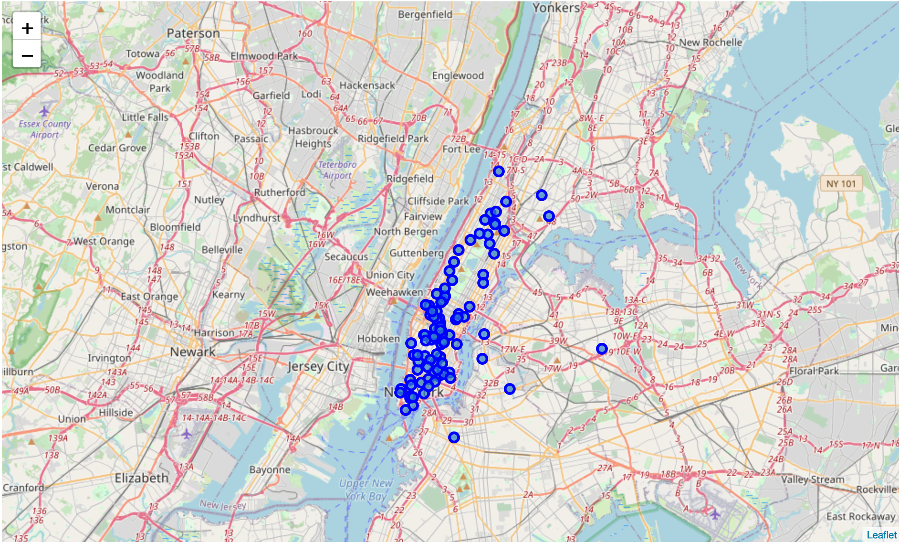
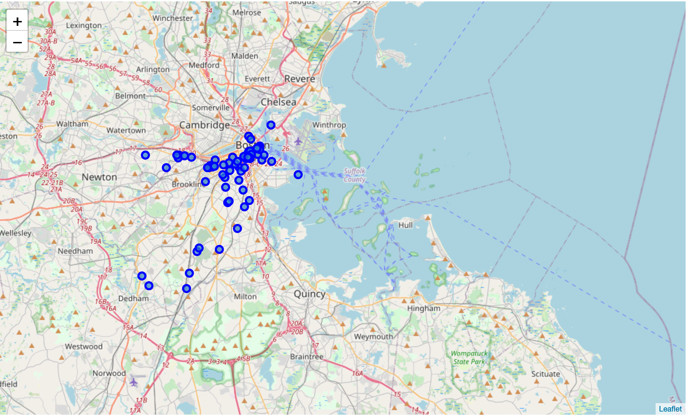
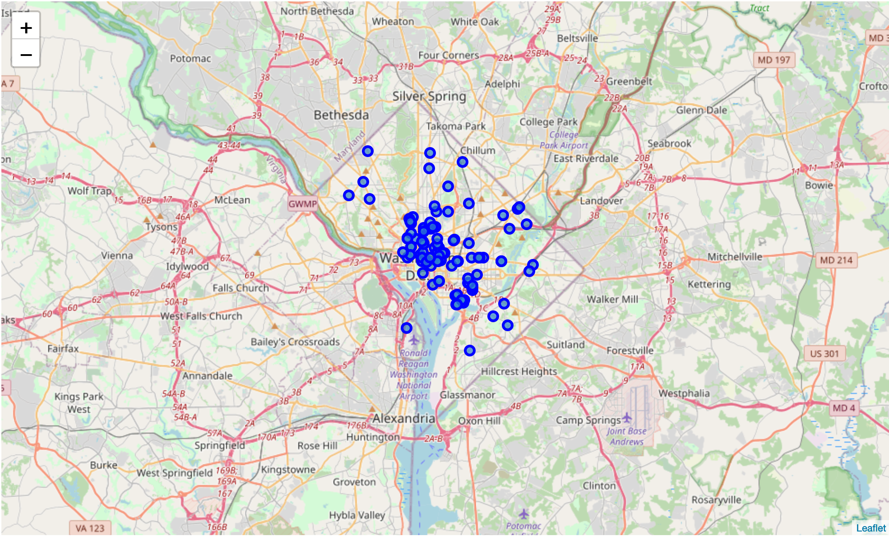
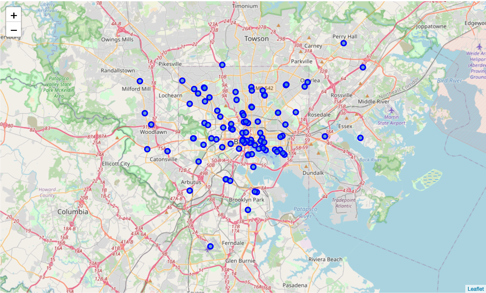
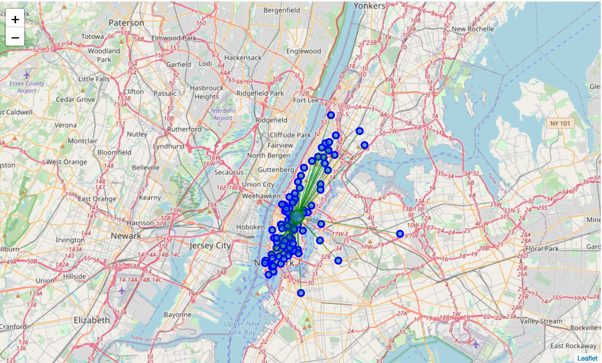
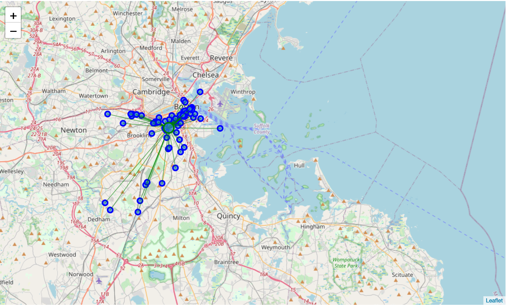
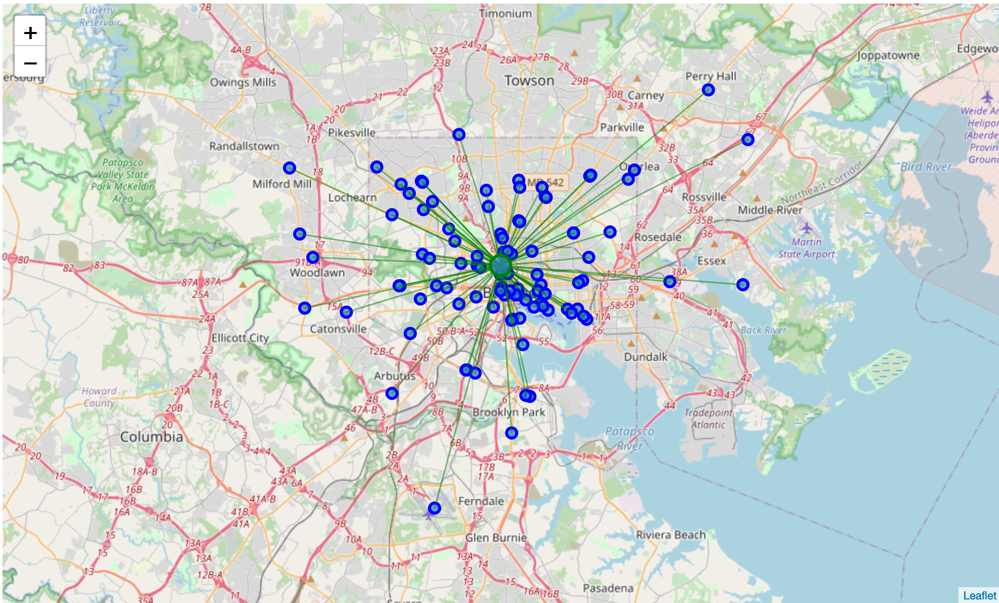

# Coursera Capstone Final Report
## Problem Background
As someone from Oklahoma, I have been raised on a steady diet of fried chicken (stereotypical but very true). For people like me, when traveling, I like to taste the various different flavors of fried chicken that different parts of the US have to have offer. The issue? Our traveler has not been to the NE so they are not sure the best cities to get a taste are.
## Data
To get the date needed for this problem, I am using the FourSquare API to collect data about locations of fried chicken restaurants in 5 major NE US cities: New York, NY, Newark, NJ, Boston, MA, Washington D.C. and Baltimore, MD. These are five of the top 6 most populated US cities in the Northeast Megalopolis (Hempstead, NY is ranked third but discluded to give more distinct areas).
## Project Methodology
This project's main goal is to analyze which of the 5 cities have the most fried chicken restaurant densities. The FourSquare API venues was used to get the information, with the CategoryID set to only show fried chicken restaurants. An example of this code is:

```https://api.foursquare.com/v2/venues/explore?&client_id=&client_secret=&v=20180605&New York, NY&limit=100&categoryId=4bf58dd8d48988d1ca941735```

`4d4ae6fc7a7b7dea34424761` is the FourSquare CategoryID for Fried Chicken Joint. A list of all CategoryIDs can be found [here](https://developer.foursquare.com/docs/build-with-foursquare/categories/).
The top 100 venues will be grabbed for each of the 5 cities and plotted. Lastly, the center distance between the top 100 venues will be calculated. The mean of the Euclidean distance to the center coordinate will be analyzed. The city with the smallest value will then be marked as the best city to go on a fried chicken taste adventure! 🐓
## Results
### Without Mean Data
The first section of images are geoplot generated with folium without mean distances calculated.

#### New York, NY:


#### Newark, NJ:

#### Boston, MA:

#### Washington, D.C.:

#### Baltimore, MD:

### With Mean Data
This second section of images takes the previous data and add the mean distance on top of the graph.

#### New York, NY:
0.03233821025887633

#### Newark, NJ:
0.022351513002362686

#### Boston, MA:
0.0330119757311136

#### Washington, D.C.:
0.029231510291240895

#### Baltimore, MD:
0.05517107634421137

## Analysis
Surprisingly, even though having the fewest number of fried chicken restaurants, Newark is the best place to go on this adventure. One would expect that since Newark has one of the 3 largest airports in the New York metropolitan area, a majority of the restaurants would be in the airport. Looking furher into this analysis, only one restaurant is actually in the airport (World Fried Chicken) strengthening Newark's position.
One curious observation is that the mean distance for Philadelphia is quite high. The comparison between Baltimore and the other cities is below.
```
for city in cities[0:4]:
    title_string = city + " -> " + cities[4]
    print(title_string)
    print(means[cities[4]] - means[city])
    
New York, NY -> Baltimore, MD
0.022832866085335038
Newark, NJ -> Baltimore, MD
0.032819563341848684
Boston, MA -> Baltimore, MD
0.022159100613097768
Washington D.C. -> Baltimore, MD
0.025939566052970472
```
The above analysis shows that there is a difference in mean distance between Baltimore and the other cities of a mininum of two tenths of a mile, further confirming that Baltimore is 5th on the list.
Another observation is that New York, Boston and Washington D.C. have a very small difference in the mean distance. The previous maps show that the aforementioned cities have outlier cities, most likely skewing the data. To better determine the next best city to go to for the fried chicken adventure, the first, two and five largest distances are excluded from the data and a new mean is calculated. This analysis is conducted below.
```
print("Excluding INSERT_NUMBER Largest:")
for i in range(0,4):
    if i != 1:
        venues_mean_coor = [df_venues[cities[i]]['Lat'].mean(), df_venues[cities[i]]['Lng'].mean()] 

        print(cities[i])
        print("Mean Distance from Mean coordinates")
        dists = np.apply_along_axis(lambda x: np.linalg.norm(x - venues_mean_coor),1,df_venues[cities[i]][['Lat','Lng']].values)
        dists.sort()
        print(np.mean(dists[:-1])) #Ignore the INSERT_NUMBER largest distances
```
After analysis, Boston is the next best city to visit followed by New York and and Washington D.C. It should be noted that excluding just one distance would make New York the next best city. However, excluding the top two, five and ten largest yield consistent results.
## Final Results
1. Newark, NJ
2. Boston, MA
3. New York, NY
4. Washington, D.C.
5. Baltimore, MD